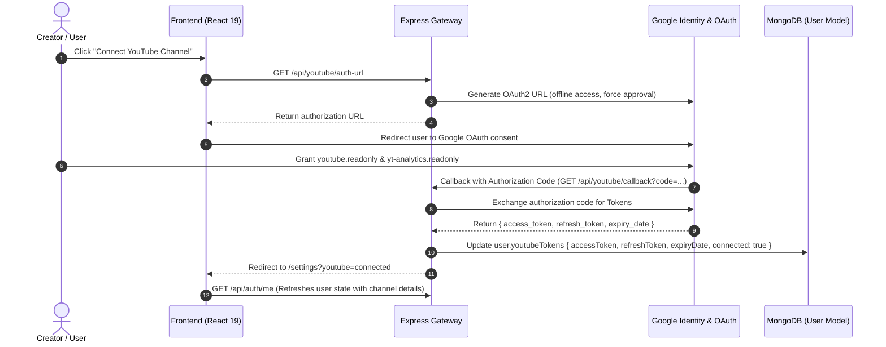
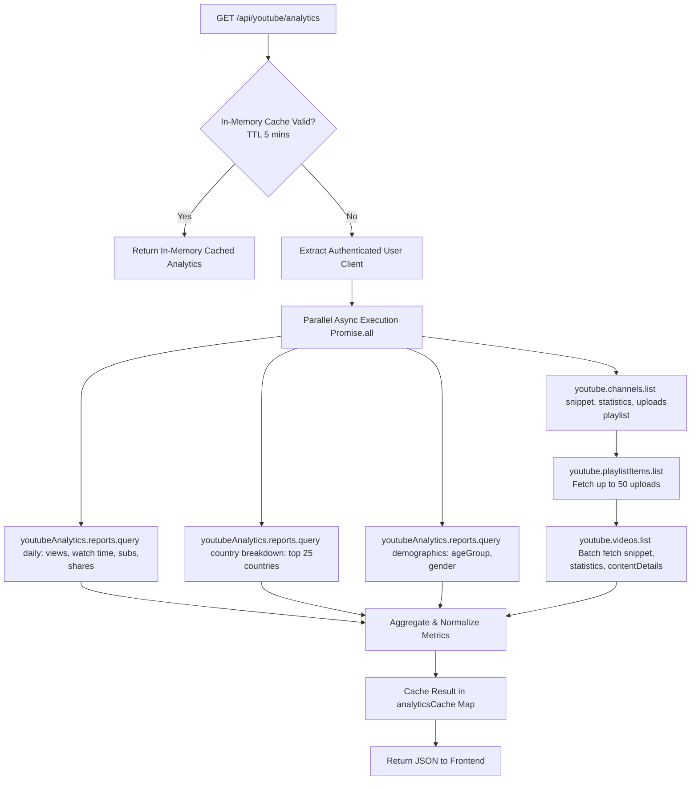
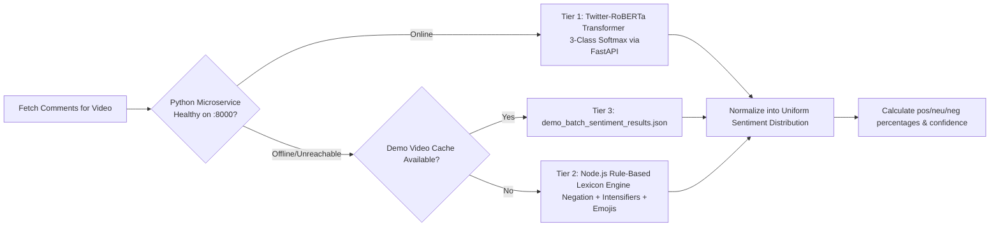
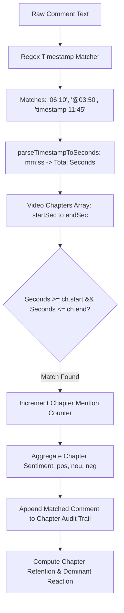
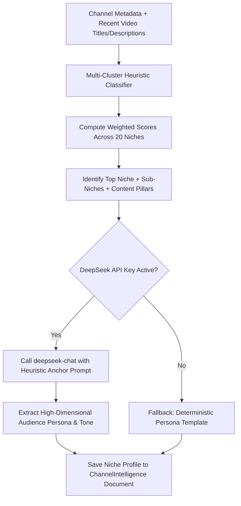
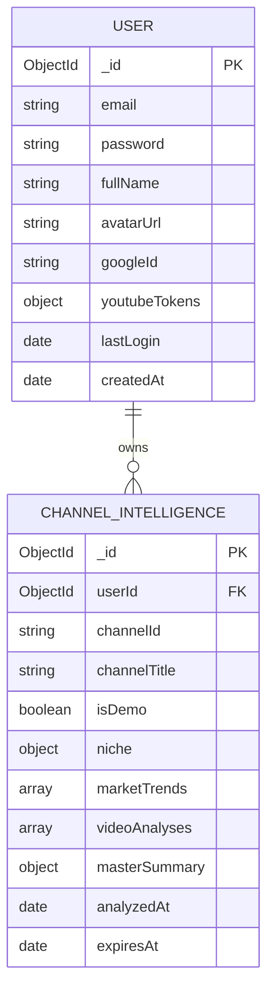

# Antigravity Studio & OnlyCreators: Comprehensive System Architecture & Engineering Specification

> **Version**: 2.4.1  
> **Classification**: Production Engineering Reference & System Blueprint  
> **Target Audience**: Core Engineers, Systems Architects, and Technical Evaluators  
> **Last Updated**: September 2026  

---

## Table of Contents
1. [Executive System Overview & Architecture Paradigm](#1-executive-system-overview--architecture-paradigm)
2. [High-Level Topology & Technology Stack](#2-high-level-topology--technology-stack)
3. [End-to-End Pipeline Workflows](#3-end-to-end-pipeline-workflows)
   - [Pipeline 1: Dual-Layer Authentication & YouTube OAuth 2.0 Lifecycle](#pipeline-1-dual-layer-authentication--youtube-oauth-20-lifecycle)
   - [Pipeline 2: Ingestion & Aggregated Channel Analytics](#pipeline-2-ingestion--aggregated-channel-analytics)
   - [Pipeline 3: Comments & Dual-Tier Sentiment Analysis Pipeline](#pipeline-3-comments--dual-tier-sentiment-analysis-pipeline)
   - [Pipeline 4: Transcripts, Chapters & Timestamp Cross-Correlation Engine](#pipeline-4-transcripts-chapters--timestamp-cross-correlation-engine)
   - [Pipeline 5: Hybrid Niche Detection & Persona Synthesis](#pipeline-5-hybrid-niche-detection--persona-synthesis)
   - [Pipeline 6: Market Trend Mining & YouTube Search Velocity Scoring](#pipeline-6-market-trend-mining--youtube-search-velocity-scoring)
   - [Pipeline 7: 3-Way Triangulation Recommendation Engine](#pipeline-7-3-way-triangulation-recommendation-engine)
   - [Pipeline 8: AI Script Studio Multi-Turn Generation Engine](#pipeline-8-ai-script-studio-multi-turn-generation-engine)
4. [Gnarly Architectural Details & Complex Edge-Case Handling](#4-gnarly-architectural-details--complex-edge-case-handling)
5. [Module-by-Module Implementation Breakdown](#5-module-by-module-implementation-breakdown)
6. [Data Models, Schemas & Entity Relationships](#6-data-models-schemas--entity-relationships)
7. [Multi-Tiered Caching Hierarchy & Hydration Strategy](#7-multi-tiered-caching-hierarchy--hydration-strategy)
8. [Configuration, Environment Variables & Runbook](#8-configuration-environment-variables--runbook)

---

## 1. Executive System Overview & Architecture Paradigm

### 1.1 The Core Problem Statement
Creators and digital media brands operate on modern algorithmic video platforms (primarily YouTube) using isolated, surface-level analytics: views, click-through rates (CTR), and retention drop-offs. However, these vanity metrics fail to reveal **qualitative audience cognitive resonance**:
- *Did the audience understand the creator's core pedagogical thesis, or did they fixate on a superficial tangent?*
- *What specific video timestamp generated confusion, debate, or excitement in the comments?*
- *Which rising algorithmic topic trends intersect directly with the channel's verified audience demand?*

**Antigravity Studio (OnlyCreators)** is a distributed content intelligence and optimization platform engineered to bridge the semantic divide between raw telemetry data and editorial content strategy.

### 1.2 System Architecture Paradigm
The platform is designed around a **polyglot distributed microservices architecture**:
1. **Node.js/Express Orchestration Gateway**: Manages authentication, session tokens, external YouTube Data & Analytics API synchronization, synthesis coordination, and business logic persistence.
2. **Python/FastAPI Deep Learning Microservice**: Hosts a dedicated HuggingFace PyTorch Transformer pipeline (`cardiffnlp/twitter-roberta-base-sentiment-latest`) providing low-latency, GPU/CPU batch inference across thousands of viewer comments.
3. **DeepSeek-Chat LLM Cognitive Engine**: Executes high-dimensional semantic analysis, video alignment scoring, content-versus-perception gap discovery, and multi-turn YouTube script generation.
4. **React 19 / Vite Single Page Application**: Delivers an interactive, zero-latency dashboard featuring responsive charts, instant synchronous cache hydration, and an embedded production script studio.
5. **MongoDB / Supabase Data Layer**: Provides schema-validated document storage for users, OAuth credentials, and aggregated channel intelligence models.

---

## 2. High-Level Topology & Technology Stack

### 2.1 System Architecture Topology Diagram

```
                             +-------------------------------------------------------+
                             |                     CLIENT BROWSER                    |
                             |       React 19 + Vite + TailwindCSS + Recharts       |
                             +---------------------------+---------------------------+
                                                         |
                                      HTTPS / WSS / REST | Cookie: token (JWT)
                                                         v
                             +-------------------------------------------------------+
                             |              EXPRESS ORCHESTRATION GATEWAY            |
                             |                     (Port 5000)                       |
                             |                                                       |
                             |  +--------------------+      +---------------------+  |
                             |  |   authController   |      |  youtubeController  |  |
                             |  +--------------------+      +---------------------+  |
                             |  +--------------------+      +---------------------+  |
                             |  |  trendsController  |      |   deepseekService   |  |
                             |  +--------------------+      +---------------------+  |
                             +-----------+-----------------------+-------------------+
                                         |                       |
            +----------------------------+                       +-------------------+
            | Internal REST                                                          | External HTTPS
            v (Port 8000)                                                            v
+-----------------------------+     +------------------------+      +-------------------------------+
|     SENTIMENT MICROSERVICE  |     |   MONGODB ATLAS / URI  |      |     EXTERNAL SERVICES         |
|      (FastAPI + Uvicorn)    |     |                        |      |                               |
|                             |     | - users (Auth & Tokens)|      | 1. Google OAuth 2.0           |
| - Twitter-RoBERTa (3-Class) |     | - channelintelligences |      | 2. YouTube Data API v3        |
| - PyTorch Batch Pipeline    |     |                        |      | 3. YouTube Analytics API      |
| - youtube-transcript-api    |     +------------------------+      | 4. DeepSeek AI Chat API       |
+-----------------------------+                                     +-------------------------------+
```

### 2.2 Technology Stack Matrix

| Layer | Technology | Version | Architectural Responsibility |
| :--- | :--- | :--- | :--- |
| **Frontend UI** | React | 19.x | Component hierarchy, virtual DOM reconciliation, state hydration |
| **Frontend Bundler** | Vite | 7.3.x | ESM hot module reloading, chunk splitting, tree-shaking |
| **State & Navigation** | React Router DOM | 7.x | Client-side routing, protected auth guards, URL parameter sync |
| **Visuals & Charts** | Recharts, Framer Motion | Latest | SVG analytics charts (area, line, donut) and smooth transitions |
| **Backend Gateway** | Node.js / Express | 18+ / 4.x | REST routing, OAuth handshake, token refresh, aggregation logic |
| **API Client** | Googleapis | Latest | Official Google OAuth2, YouTube Data v3, YouTube Analytics API |
| **Sentiment Service**| FastAPI / Uvicorn | 0.100+ | Asynchronous high-throughput Python API with OpenAPI docs |
| **Machine Learning** | PyTorch / Transformers| 4.x | HuggingFace pipeline running Twitter-RoBERTa 3-class model |
| **AI LLM Engine** | DeepSeek-Chat | v3 | Structured JSON generation, channel niche detection, script studio |
| **Database** | MongoDB / Mongoose | 8.x | Document database for persistent channel intelligence and users |
| **Auth Security** | JWT / Bcrypt.js | Latest | HTTP-only encrypted cookies, bcrypt salt rounds (10), token expiry |

---

## 3. End-to-End Pipeline Workflows

### Pipeline 1: Dual-Layer Authentication & YouTube OAuth 2.0 Lifecycle

The platform implements a **two-tier authentication architecture**:
1. **Tier 1 (Application Identity)**: The user signs up or logs into the platform either via Email/Password (bcrypt-hashed) or standard Google OAuth (`userinfo.profile`, `userinfo.email`). An encrypted HTTP-only cookie (`token`) containing the user's MongoDB `_id` is issued with a 7-day TTL.
2. **Tier 2 (YouTube Channel Delegated Access)**: To analyze channel data, the user triggers the channel connection workflow. This invokes an incremental Google OAuth 2.0 consent screen requesting read-only YouTube scopes:
   - `https://www.googleapis.com/auth/youtube.readonly`
   - `https://www.googleapis.com/auth/yt-analytics.readonly`



#### Proactive Token Refresh Window
Google access tokens expire in 3600 seconds (1 hour). Standard architectures fail when an expired token is used midway through a batch query. Antigravity Studio enforces a **proactive 120-second threshold**:
```javascript
const isExpired = expiryDate ? Date.now() >= (expiryDate - 120000) : false;
if (isExpired && refreshToken) {
  const { credentials } = await auth.refreshAccessToken();
  // Persist updated credentials into MongoDB immediately
  await User.findByIdAndUpdate(userId, {
    $set: {
      'youtubeTokens.accessToken': credentials.access_token,
      'youtubeTokens.expiryDate': credentials.expiry_date,
      'youtubeTokens.connected': true
    }
  });
}
```
Furthermore, the gateway attaches an event listener to the OAuth2 client (`auth.on('tokens', ...)`) to capture opportunistic tokens emitted asynchronously during nested requests.

---

### Pipeline 2: Ingestion & Aggregated Channel Analytics

When loading `/dashboard`, `/analytics`, or `/audience`, the platform coordinates parallel querying across YouTube Data v3 and YouTube Analytics APIs.



#### Dynamic Date-Range Filtering Architecture
Rather than executing redundant external API requests when a creator switches between `7d`, `30d`, `90d`, `1y`, or `all`, the frontend service ([`analyticsService.js`](file:///home/ahmed/Downloads/Programming%20Projects/Final%20year%20project/frontend/src/services/analyticsService.js)) dynamically calculates period-specific totals from the pre-aggregated daily rows:
- `periodViews`: Sum of views for the selected day count.
- `periodWatchTimeMinutes`: Sum of watch time minutes for the window.
- `periodNetSubs`: `subscribersGained - subscribersLost` over the sliced window.
- `sparklines`: Daily arrays interpolated and formatted for micro-visualizations.
- `engagementBreakdown`: Calibrated counts of `{ likes, comments, shares }` mapped directly to SVG donut charts.

---

### Pipeline 3: Comments & Dual-Tier Sentiment Analysis Pipeline

Audience sentiment analysis is executed through a **three-layer fallback hierarchy** ensuring zero points of failure:



#### 1. Tier 1: Deep Learning Transformer Microservice (`sentiment_service/main.py`)
- **Model**: `cardiffnlp/twitter-roberta-base-sentiment-latest`
- **Classes**: `POSITIVE`, `NEUTRAL`, `NEGATIVE`
- **Batch Processing**: The endpoint `POST /analyze-batch` accepts arrays of `CommentItem`. Texts are truncated to the model's 512-token limit to prevent matrix overflow in self-attention heads:
  ```python
  texts = [c.text[:512] for c in req.comments]
  batch_results = sentiment_pipeline(texts)
  ```
- **Probability Softmax**: Returns the raw confidence score for each class, identifying the top prediction with 4-decimal precision.

#### 2. Tier 2: Calibrated Lexicon & Rule-Based Fallback Engine (`sentimentService.js`)
If the Python microservice is offline or deploying, the Express gateway automatically fails over to an in-process linguistic scoring engine:
- **Lexicon Weights**:
  - Strong positives: `love (3.0)`, `masterpiece (3.5)`, `phenomenal (3.5)`
  - Strong negatives: `garbage (-3.5)`, `clickbait (-3.0)`, `scam (-3.5)`
  - Emoji analysis: `🔥 (2.5)`, `🚀 (2.5)`, `🗑️ (-3.0)`, `🤮 (-3.0)`
- **Negation Inversion Window**: When a negation token (`not`, `never`, `dont`, `cannot`) is detected, the subsequent 3 words have their sentiment inverted by `-0.85x`.
- **Intensifier Multipliers**: Adverbs (`extremely`, `insanely`, `completely`, `100%`) amplify preceding or following words by factors of `1.2x` to `1.6x`.
- **Probability Softmax Transform**: Converts the net score into realistic probabilities:
  $$\text{pos\_score} = \frac{1}{1 + e^{-0.6 \cdot (\text{net} - 0.25)}}$$
  $$\text{neg\_score} = \frac{1}{1 + e^{0.6 \cdot (\text{net} + 0.25)}}$$

---

### Pipeline 4: Transcripts, Chapters & Timestamp Cross-Correlation Engine

One of the most architecturally unique components of Antigravity Studio is the **Timestamped Comment Cross-Correlation Engine** ([`transcriptService.js`](file:///home/ahmed/Downloads/Programming%20Projects/Final%20year%20project/backend/services/transcriptService.js)).



#### The Timestamp Parsing Expression
```javascript
const timestampRegex = /\b(?:at\s+|@\s*|timestamp\s*:?\s*)?(\d{1,2}:\d{2}(?::\d{2})?)\b/gi;
```
This regex captures non-linear timestamp references from conversational text:
- `"The part at 06:10 blew my mind!"` $\rightarrow$ parses `06:10` $\rightarrow$ `370 seconds`.
- Matched with Chapter 4: `Magnetic Levitation vs True Antigravity (start: 370s, end: 510s)`.
- Increments Chapter 4 positive mention tally and logs the comment for interactive drill-down.

---

### Pipeline 5: Hybrid Niche Detection & Persona Synthesis

Before recommendations or trends can be curated, the platform must determine the channel's exact technical niche.



#### The 20-Cluster Multi-Keyword Matrix (`deepseekService.js`)
The heuristic classifier scans token frequencies across 20 distinct technical and creative domains:
- `Astrophysics & Space Tech` (keywords: *black hole, quantum, relativity, exoplanet, spacetime, jwst*)
- `Artificial Intelligence & Data Science` (keywords: *neural, llm, transformer, pytorch, agent, deep learning*)
- `Web Development & Engineering` (keywords: *react, javascript, docker, kubernetes, fullstack, api*)
- `Cybersecurity & Ethical Hacking` (keywords: *penetration, malware, buffer overflow, cryptography*)
- Plus: *Finance, Gaming, Robotics, Biotech, Cinema, Automotive, Clean Energy, etc.*

---

### Pipeline 6: Market Trend Mining & YouTube Search Velocity Scoring

Market trend discovery ([`trendService.js`](file:///home/ahmed/Downloads/Programming%20Projects/Final%20year%20project/backend/services/trendService.js) and [`trendsController.js`](file:///home/ahmed/Downloads/Programming%20Projects/Final%20year%20project/backend/controllers/trendsController.js)) operates by querying YouTube Search v3 using curated keywords derived from the channel's verified niche pillars.

#### Logarithmic Opportunity Score Algorithm
To avoid raw view counts skewing opportunity scores (e.g., an entertainment video with 20M views overshadowing a high-retention technical tutorial with 300K views), the system calculates a logarithmic opportunity metric:
$$\text{ViewScore} = \min\left(60, \left\lfloor \frac{\log_{10}(\text{views} + 1)}{7} \times 60 \right\rfloor\right)$$
$$\text{QualityScore} = \min\left(40, \left\lfloor \frac{\text{likeRatio}}{100} \times 40 \right\rfloor\right)$$
$$\text{OpportunityScore} = \max(50, \min(99, \text{ViewScore} + \text{QualityScore}))$$

This produces a calibrated `0 - 100` score reflecting topic momentum, search velocity, and viewer reception.

---

### Pipeline 7: 3-Way Triangulation Recommendation Engine

The core intellectual property of the Insights engine is the **3-Way Content Triangulation Engine**:

```
                              [ 1. AUDIENCE DEMAND ]
                           (Unmet questions, friction,
                             requests in comments)
                                      / \
                                     /   \
                                    /     \
                                   /  (A)  \
                                  /  OVERLAP\
                                 /  SWEETSPOT\
                                /             \
        [ 2. CHANNEL STRENGTHS ]---------------+---------------[ 3. MARKET MOMENTUM ]
       (Proven formats, creator               (Surging search trends,
         authority, niche pillars)             high-velocity topic spikes)
```

The synthesis engine categorizes output into three distinct strategic recommendation sets:
1. **Overlap Recommendations (`overlap`)**: The highest-priority ideas. These occur where surging external market interest aligns directly with unresolved audience inquiries found in the creator's comment section.
2. **Audience Demand Recommendations (`demand`)**: High-fidelity responses to verified viewer questions and misconceptions, designed to maximize loyalty, average view duration (AVD), and comment velocity.
3. **Macro Trend Recommendations (`trend`)**: Fast-rising industry breakthroughs adapted into the creator's signature editorial voice.

---

### Pipeline 8: AI Script Studio Multi-Turn Generation Engine

When a creator clicks **"Script this"** on any recommendation, the idea object is passed into the **AI Script Studio** ([`ScriptStudio.jsx`](file:///home/ahmed/Downloads/Programming%20Projects/Final%20year%20project/frontend/src/pages/ScriptStudio.jsx)).

#### Script Architecture Protocol
The DeepSeek system prompt enforces a production-ready script blueprint:
- **Phase 1: The First 15 Seconds (The Retention Hook)**:
  - Immediate statement of the premise.
  - Provocative stakes with zero introductory fluff or generic channel welcomes.
  - Visual director cue specifying on-screen motion graphics.
- **Phase 2: The Core Body Architecture (Cognitive Escalation)**:
  - 3 structured acts with visual and auditory cues (e.g. `[VISUAL: 3D render of ergosphere frame-dragging]`, `[AUDIO: Sub-bass swell]`).
  - Pedagogical analogies tailored to the channel persona.
- **Phase 3: The Climax & Call-to-Action**:
  - Resolution of the primary thesis.
  - Frictionless seamless transition into the next recommended video.
- **Metadata Package**:
  - 3 algorithmic click-worthy title options.
  - SEO description with chapter timestamps.
  - High-CTR thumbnail conceptual descriptions.

---

## 4. Gnarly Architectural Details & Complex Edge-Case Handling

### 4.1 Proactive Token Expiration vs. Google API Race Conditions
*The Problem*: Standard OAuth token validation checks `if (token.isExpired())`. However, in high-latency network calls or parallel `Promise.all` queries, a token that was valid at the start of the query can expire before the 4th nested sub-query finishes, causing an unhandled `401 Unauthorized` / `invalid_grant` crash.

*The Solution*:
1. The token lifecycle check enforces an aggressive `120,000ms` (2 minutes) pre-expiration refresh window.
2. If `credentials.refresh_token` is omitted during subsequent refresh exchanges (standard Google behavior unless `access_type=offline` and `prompt=consent` are passed), the system preserves the existing refresh token in MongoDB.
3. If Google issues an `invalid_grant` (e.g., user revoked permissions via Google Account Security), the system automatically updates `youtubeTokens.connected = false`, strips invalid credentials, and triggers a clean re-connection prompt rather than throwing unhandled server exceptions.

### 4.2 Handling 512-Token Limits in Transformer Self-Attention
*The Problem*: Passing unrestricted YouTube comments to the CardiffNLP RoBERTa transformer causes Python memory spikes or dimension exceptions if a user posts a 2000-word essay.

*The Solution*:
- The microservice strips HTML markup (`<br>`, `<a>`, emojis), truncates the input string to 512 characters, and constructs a dense batch payload:
  ```python
  texts = [c.text[:512] for c in req.comments]
  ```
- PyTorch runs batched forward passes using Torch tensor slices without invoking backpropagation gradients (`torch.no_grad()`), keeping memory footprint under 450 MB RAM on CPU.

### 4.3 Linguistic Negation Window & Softmax Calibration in Lexicon Engine
*The Problem*: In naive sentiment analyzers, the comment *"This is not good at all, completely disappointing"* yields a false positive because `"good"` (+1.5) and `"completely"` (+1.4) can outweigh `"disappointing"` (-2.2).

*The Solution*:
- The lexicon engine ([`sentimentService.js`](file:///home/ahmed/Downloads/Programming%20Projects/Final%20year%20project/backend/services/sentimentService.js)) implements a 3-word lookahead buffer. When a negator (`not`, `never`, `dont`, `cant`, `without`) is encountered, a multiplier of `-0.85` is applied to subsequent words until punctuation or the 3-word limit is reached.
- Intensifiers (`insanely`, `completely`, `100%`) multiply the next adjacent sentiment token rather than contributing standalone positive points.

### 4.4 Non-Linear Chapter Mapping & Timestamp Disambiguation
*The Problem*: A comment might say: *"Check out 02:15 and 08:30, way better than 14:00"*.
- Standard regex string splits fail when a comment contains multiple timestamps.
- Comments might use `mm:ss` or `hh:mm:ss`.

*The Solution*:
- The regex `/\b(?:at\s+|@\s*|timestamp\s*:?\s*)?(\d{1,2}:\d{2}(?::\d{2})?)\b/gi` uses `matchAll` to capture all timestamps.
- A parser converts each match to absolute integer seconds:
  ```javascript
  const parseTimestampToSeconds = (tsStr) => {
    const parts = tsStr.trim().split(':').map(Number);
    if (parts.length === 2) return parts[0] * 60 + parts[1];
    if (parts.length === 3) return parts[0] * 3600 + parts[1] * 60 + parts[2];
    return null;
  };
  ```
- Binary range detection locates the exact video chapter where `seconds >= chapter.start && seconds <= chapter.end`.

### 4.5 Multi-Tier Resilience & Zero-Quota Cold Start
*The Problem*: During local development, academic demonstrations, or when the YouTube API daily quota (10,000 units) is exceeded, the application must not crash or display blank screens.

*The Solution*:
- The platform maintains a high-fidelity synthetic physics & deep-tech channel dataset ([`mockYoutubeData.js`](file:///home/ahmed/Downloads/Programming%20Projects/Final%20year%20project/backend/config/mockYoutubeData.js)) matching real-world schema dimensions.
- If live YouTube credentials are unlinked or API quotas reject with status `403 quotaExceeded`, the backend automatically falls back to generating consistent mock analytics, transcripts, and comments without surfacing error modals to the user.

---

## 5. Module-by-Module Implementation Breakdown

### 5.1 Backend Gateway (`backend/`)

#### [`backend/index.js`](file:///home/ahmed/Downloads/Programming%20Projects/Final%20year%20project/backend/index.js)
- **Role**: Express server entry point.
- **Middlewares**: `cors({ origin: 'http://localhost:5173', credentials: true })`, `morgan('dev')`, `cookieParser()`, `express.json()`.
- **Route Registrations**: Mounts `/api/auth`, `/api/youtube`, `/api/trends`.
- **Database Initializer**: Calls `connectDB()`.

#### [`backend/controllers/authController.js`](file:///home/ahmed/Downloads/Programming%20Projects/Final%20year%20project/backend/controllers/authController.js)
- **`login`**: Initiates Google OAuth redirect for app authentication.
- **`callback`**: Exchanges Google code for tokens, retrieves Google profile, creates/updates `User` in MongoDB, issues HTTP-only JWT cookie (`token`), and redirects to `/dashboard`.
- **`emailSignup` / `emailSignin`**: Traditional credentials path with bcrypt password hashing (10 salt rounds) and JWT issuance.
- **`logout`**: Clears the HTTP-only cookie with matching domain/path options.
- **`getCurrentUser`**: Validates JWT and returns sanitized user session object.

#### [`backend/controllers/youtubeController.js`](file:///home/ahmed/Downloads/Programming%20Projects/Final%20year%20project/backend/controllers/youtubeController.js)
- **`getAuthUrl`**: Generates Google OAuth URL specifically for YouTube read-only scopes.
- **`handleCallback`**: Handles OAuth callback, saves channel tokens in `User.youtubeTokens`.
- **`getYoutubeAnalytics`**: Executes parallel queries across YouTube Data and Analytics APIs with in-memory caching (`analyticsCache`, 5m TTL).
- **`getVideoAnalytics`**: Returns individual video metrics, daily views, retention, and geographic distribution.
- **`getVideoComments`**: Fetches top 50 comments and runs them through the sentiment pipeline.
- **`getVideoInsights`**: Aggregates video description, transcript, chapter timestamp sentiment heatmaps, and DeepSeek AI analysis.
- **`getChannelIntelligence`**: Retrieves cached `ChannelIntelligence` MongoDB document.
- **`analyzeChannelIntelligence`**: Triggers full end-to-end multi-step channel intelligence pipeline.
- **`handleScriptStudioChat`**: Handles interactive multi-turn AI script writing conversations with DeepSeek.

#### [`backend/controllers/trendsController.js`](file:///home/ahmed/Downloads/Programming%20Projects/Final%20year%20project/backend/controllers/trendsController.js)
- **`getLiveTrends`**: Queries YouTube Search v3 using channel niche pillars and calculates opportunity scores.
- **`getLiveTrendsCached`**: Returns cached trend sets to conserve external API quotas.
- **`getPythonServiceHealth`**: Performs HTTP heartbeat check against `http://localhost:8000/health`.

#### [`backend/services/deepseekService.js`](file:///home/ahmed/Downloads/Programming%20Projects/Final%20year%20project/backend/services/deepseekService.js)
- **`generateVideoIntelligence`**: Generates video alignment score, creator intent vs audience takeaway, and key misconceptions.
- **`classifyChannelNicheHeuristic`**: 20-cluster keyword heuristic classifier that analyzes titles and descriptions.
- **`detectChannelNiche`**: Hybrid AI + heuristic niche detector.
- **`analyzeVideoDeeply`**: Performs deep synthesis across video content, transcripts, comments, and sentiment distributions.
- **`generateMasterChannelSynthesis`**: Master synthesis engine computing Overlap, Demand, and Trend recommendations.
- **`chatScriptStudio`**: Conversational script writing agent enforcing professional 3-act YouTube retention structure.

#### [`backend/services/sentimentService.js`](file:///home/ahmed/Downloads/Programming%20Projects/Final%20year%20project/backend/services/sentimentService.js)
- **`getCommentsSentiment`**: Dispatches comments to FastAPI microservice with fallback to `analyzeCommentTextLocally`.
- **`analyzeCommentTextLocally`**: Rule-based sentiment analyzer with emoji dictionary, intensifier scaling, and negation lookback.

#### [`backend/services/transcriptService.js`](file:///home/ahmed/Downloads/Programming%20Projects/Final%20year%20project/backend/services/transcriptService.js)
- **`extractTimestampSentiments`**: Cross-references comment timestamps with video chapters to create sentiment heatmaps.
- **`getVideoTranscriptData`**: Retrieves timestamped transcripts from Python service or demo datasets.

#### [`backend/services/trendService.js`](file:///home/ahmed/Downloads/Programming%20Projects/Final%20year%20project/backend/services/trendService.js)
- **`fetchAndSynthesizeMarketTrends`**: Queries live trends and calculates logarithmic opportunity scores.
- **`generateNicheTrendsFallback`**: Generates rich domain-specific trend models if YouTube API is offline.

---

### 5.2 Python Deep Learning Microservice (`sentiment_service/`)

#### [`sentiment_service/main.py`](file:///home/ahmed/Downloads/Programming%20Projects/Final%20year%20project/sentiment_service/main.py)
- **Framework**: FastAPI running under Uvicorn ASGI server on port 8000.
- **Pipeline Setup**:
  ```python
  sentiment_pipeline = pipeline(
      "sentiment-analysis",
      model="cardiffnlp/twitter-roberta-base-sentiment-latest",
      tokenizer="cardiffnlp/twitter-roberta-base-sentiment-latest",
      top_k=None
  )
  ```
- **Endpoints**:
  - `GET /health`: Returns service status, active model name, and memory readiness.
  - `GET /transcript?videoId=...`: Uses `youtube_transcript_api` to extract raw subtitles with start times and durations.
  - `POST /analyze`: Analyzes a single string payload.
  - `POST /analyze-batch`: Accepts a list of comments, performs batched transformer inference, and computes aggregate positive, neutral, and negative distributions.

---

### 5.3 Frontend Application (`frontend/src/`)

#### Services Layer
- [`frontend/src/services/api.js`](file:///home/ahmed/Downloads/Programming%20Projects/Final%20year%20project/frontend/src/services/api.js): Axios instance configured with `withCredentials: true`, global error interceptors, and 401 redirect logic.
- [`frontend/src/services/analyticsService.js`](file:///home/ahmed/Downloads/Programming%20Projects/Final%20year%20project/frontend/src/services/analyticsService.js): Client-side analytics slicing and sparkline generator across time ranges (`7d`, `30d`, `90d`, `1y`, `all`).
- [`frontend/src/services/trendsService.js`](file:///home/ahmed/Downloads/Programming%20Projects/Final%20year%20project/frontend/src/services/trendsService.js): Manages intelligence caching, synchronous hydration via `localStorage`, and script generation calls.

#### Key Pages
- [`frontend/src/pages/Dashboard.jsx`](file:///home/ahmed/Downloads/Programming%20Projects/Final%20year%20project/frontend/src/pages/Dashboard.jsx): Primary command center. Renders period-aware metric cards, `PerformanceChart` (views & watch time), `EngagementChart` (likes/comments/shares donut), and `VideoTable` with deep-dive modal launchers.
- [`frontend/src/pages/Insights.jsx`](file:///home/ahmed/Downloads/Programming%20Projects/Final%20year%20project/frontend/src/pages/Insights.jsx): Strategy command center. Displays detected niche and persona banner, filtered recommendations (All, Overlap, Demand, Trend), circular score rings, evidence drawers, and content quality recommendations.
- [`frontend/src/pages/Trends.jsx`](file:///home/ahmed/Downloads/Programming%20Projects/Final%20year%20project/frontend/src/pages/Trends.jsx): Displays live topic velocity, search momentum, opportunity scores, and hashtag clusters.
- [`frontend/src/pages/ScriptStudio.jsx`](file:///home/ahmed/Downloads/Programming%20Projects/Final%20year%20project/frontend/src/pages/ScriptStudio.jsx): Full-page production writing environment with real-time prompt streaming, version history, and copy-ready formatting.
- [`frontend/src/pages/Audience.jsx`](file:///home/ahmed/Downloads/Programming%20Projects/Final%20year%20project/frontend/src/pages/Audience.jsx): Geographic heat maps, age/gender distributions, and viewer loyalty breakdowns.
- [`frontend/src/pages/Settings.jsx`](file:///home/ahmed/Downloads/Programming%20Projects/Final%20year%20project/frontend/src/pages/Settings.jsx): Profile management, YouTube OAuth connect/disconnect buttons, and app theme configuration.

---

## 6. Data Models, Schemas & Entity Relationships



### 6.1 `User` Schema Details
```javascript
youtubeTokens: {
  accessToken: { type: String },
  refreshToken: { type: String },
  expiryDate: { type: Number },
  connected: { type: Boolean, default: false },
  channelId: { type: String },
  channelTitle: { type: String }
}
```

### 6.2 `ChannelIntelligence` Schema Details
Contains 4 major nested sub-documents:
1. `niche`: `{ primary_niche, sub_niches[], target_audience, content_tone, content_pillars[], differentiators[] }`
2. `marketTrends`: `[{ id, topic, category, strength, opportunityScore, searchVolume, growthData[], hashtags[], marketInsight, relatedVideos[] }]`
3. `videoAnalyses`: `[{ videoId, title, thumbnailUrl, metrics, sentimentSummary, performance_tier, strengths[], weaknesses[], audience_demands_identified[], engagement_driver, deep_analysis }]`
4. `masterSummary`: Contains categorized recommendation arrays:
   - `overlap_recommendations`
   - `demand_recommendations`
   - `trend_recommendations`
   - Each recommendation conforms to:
     `{ id, title, hook, angle, target_audience, why_it_will_perform, recommendation_type, trend_source, audience_demand_source, overlap_rationale, estimated_potential, suggested_format }`

---

## 7. Multi-Tiered Caching Hierarchy & Hydration Strategy

To achieve sub-50ms render times across navigation without stale data or unnecessary API costs, the system uses a **quad-tier caching strategy**:

```
+-----------------------------------------------------------------------------------+
| 1. Client Synchronous Memory (useState + getCachedIntelligence)                   |
|    - Storage: localStorage                                                        |
|    - TTL: 15 minutes                                                              |
|    - Purpose: Instant initial state hydration on page return (Zero Skeleton)      |
+-----------------------------------------+-----------------------------------------+
                                          | Cache Miss / Explicit Re-analyze
                                          v
+-----------------------------------------------------------------------------------+
| 2. Gateway In-Memory LRU Map (analyticsCache & intelligenceCache)                 |
|    - Storage: Node.js V8 Process Memory                                           |
|    - TTL: 5 minutes                                                               |
|    - Purpose: Eliminates duplicate requests from concurrent tabs / components     |
+-----------------------------------------+-----------------------------------------+
                                          | Cache Miss
                                          v
+-----------------------------------------------------------------------------------+
| 3. Database Document Persistence (ChannelIntelligence Model)                      |
|    - Storage: MongoDB Atlas Collection                                            |
|    - TTL: 24 hours (indexed via expiresAt)                                        |
|    - Purpose: Long-term synthesis persistence across creator sessions             |
+-----------------------------------------+-----------------------------------------+
                                          | Stale / Expired
                                          v
+-----------------------------------------------------------------------------------+
| 4. External Compute Layer (DeepSeek Chat API + RoBERTa Microservice)              |
|    - Latency: 3.5s - 8.0s                                                         |
|    - Purpose: High-dimensional semantic computation and LLM synthesis             |
+-----------------------------------------------------------------------------------+
```

### Zero-Flicker Synchronous Hydration Pattern
In [`Insights.jsx`](file:///home/ahmed/Downloads/Programming%20Projects/Final%20year%20project/frontend/src/pages/Insights.jsx):
```javascript
// Initial state evaluated synchronously BEFORE first render:
const [channelIntel, setChannelIntel] = useState(() => trendsService.getCachedIntelligence());
const [loadingIntel, setLoadingIntel] = useState(() => !trendsService.getCachedIntelligence());
const [isLoading, setIsLoading] = useState(() => !trendsService.getCachedIntelligence());
```
When navigating away from Insights to Dashboard and returning, the page renders immediately from localStorage with **zero skeleton flash**, while an asynchronous background task checks for upstream updates.

---

## 8. Configuration, Environment Variables & Runbook

### 8.1 Environment Variables Configuration

#### Backend Gateway (`backend/.env`)
```bash
# Server Configuration
PORT=5000
NODE_ENV=development

# Database Connections
MONGO_URI=mongodb+srv://<username>:<password>@cluster0.mongodb.net/antigravity?retryWrites=true&w=majority
# Alternatively local: mongodb://127.0.0.1:27017/antigravity

# Authentication Security
JWT_SECRET=super_secure_jwt_secret_antigravity_2026

# Google OAuth 2.0 & YouTube APIs (Obtained from Google Cloud Console)
YOUTUBE_CLIENT_ID=your_google_client_id.apps.googleusercontent.com
YOUTUBE_CLIENT_SECRET=your_google_client_secret
YOUTUBE_REDIRECT_URI=http://localhost:5000/api/auth/callback
YOUTUBE_API_KEY=your_youtube_v3_api_key

# DeepSeek Cognitive Engine
DEEPSEEK_API_KEY=your_deepseek_api_key_here
DEEPSEEK_API_URL=https://api.deepseek.com/chat/completions

# Internal Microservice Connections
SENTIMENT_SERVICE_URL=http://127.0.0.1:8000
PYTHON_SERVICE_URL=http://127.0.0.1:8000
```

#### Sentiment Microservice (`sentiment_service/.env` or Runtime)
```bash
PORT=8000
MODEL_NAME=cardiffnlp/twitter-roberta-base-sentiment-latest
```

---

### 8.2 Service Launch & Orchestration Runbook

To spin up the complete end-to-end environment, run the three services concurrently:

#### 1. Start the Python Sentiment Analysis Microservice
```bash
cd sentiment_service
# Create and activate virtual environment
python3 -m venv venv
source venv/bin/activate

# Install PyTorch & Transformers
pip install -r requirements.txt

# Launch FastAPI ASGI server on port 8000
python main.py
# Or: uvicorn main:app --host 0.0.0.0 --port 8000 --reload
```
*Health Check*: `curl http://localhost:8000/health` $\rightarrow$ should return `{"status":"online", "model_loaded":true}`.

#### 2. Start the Express Orchestration Gateway
```bash
cd backend
npm install
npm run dev
# Or: node index.js
```
*Health Check*: `curl http://localhost:5000/` $\rightarrow$ returns `✅ Express + MongoDB Backend is running!`.

#### 3. Start the React 19 Frontend Development Server
```bash
cd frontend
npm install
npm run dev
```
*Client URL*: `http://localhost:5173`.

---

## 9. Summary & System Verification

The Antigravity Studio / OnlyCreators platform brings together high-throughput data processing, deep-learning NLP transformer pipelines, LLM cognitive reasoning, and reactive client architecture:
- **Resilient**: Multi-tier fallbacks prevent system crashes during API quota exhaustion or network downtime.
- **Accurate**: 3-class RoBERTa inference disambiguates nuanced viewer feedback and links timestamps directly to video chapters.
- **Actionable**: Content recommendations don't just output generic topics—they synthesize audience hunger with algorithm momentum to produce production-ready scripts.
- **Fast**: Multi-tiered caching and synchronous local hydration eliminate UI flicker and redundant backend queries.
